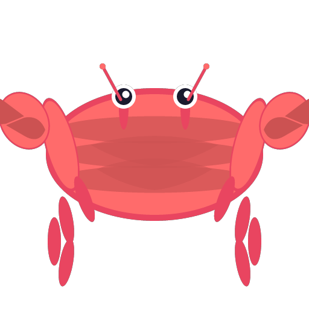

# Crabby

### Cross-platform terminal emulator written in Rust

*Built with Tauri for native performance and modern web technologies*

## ✨ Features

• **Fast & Lightweight** - Built with Rust for maximum performance

• **Cross-Platform** - Works on Windows, macOS, and Linux

• **Modern UI** - Clean interface with customizable themes

• **Native Feel** - Powered by Tauri for true native experience

• **Terminal Emulation** - Full-featured terminal with modern capabilities
